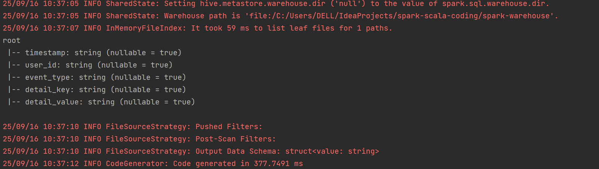
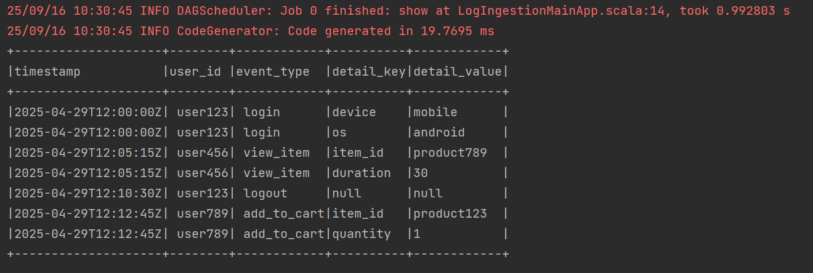
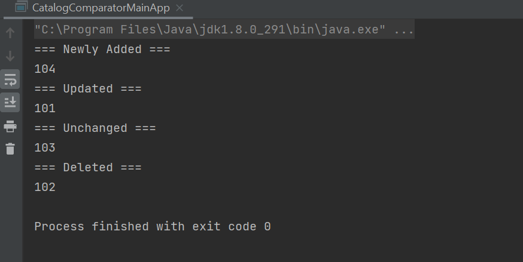
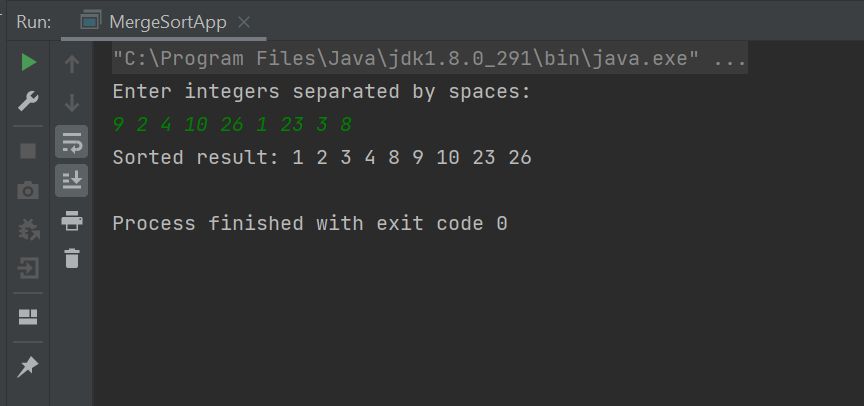

# Project: Coding Challenge Solutions 
## 📌 Overview
This repository contains solutions to the coding challenges. The problems cover a wide range of concepts, including string manipulation, mathematical logic, encoding/decoding, and algorithm optimization.The solutions are written in Scala / Spark and follow clean, modular design for readability and maintainability.

## Problems Covered
### Part I: Spark & Scala based 3 coding questions
#### Data Ingestion and Transformation Challenge
```
Problem Statement:
You are given a plain text file containing user activity logs. Each line in the file represents an event with the following comma-separated fields: timestamp, user_id, event_type, details.
Input (Example):
2025-04-29T12:00:00Z, user123, login, {"device": "mobile", "os": "android"}
2025-04-29T12:05:15Z, user456, view_item, {"item_id": "product789", "duration": 30}
2025-04-29T12:10:30Z, user123, logout, {}
2025-04-29T12:12:45Z, user789, add_to_cart, {"item_id": "product123", "quantity": 1}
Your Task:
Write a Scala/Spark application that reads this log file and transforms it into a structured format. Without using any external JSON libraries, parse the details field (which is a JSON string) and create a Spark DataFrame with the following schema:
timestamp (String)
user_id (String)
event_type (String)
detail_key (String)
detail_value (String)
For events where the details field is empty ({}), there should be no corresponding rows for detail_key and detail_value.
Output:
The resulting DataFrame should be printed to the console (showing the schema and a few sample rows).
```



#### Data Comparison and Change Tracking Challenge
```
Problem Statement:
You are given two sets of product information, representing the product catalog at two different points in time. Each product is represented as a comma-separated string with the following fields: product_id, name, description, price, category.
Yesterday's Catalog (Example):
101, Awesome Gadget, A truly awesome gadget, 29.99, Electronics
102, Super Widget, The ultimate widget, 19.99, Home Goods
103, Fancy Thingamajig, A very fancy thingamajig, 99.99, Luxury
Today's Catalog (Example):
101, Awesome Gadget, Now even more awesome!, 34.99, Electronics
103, Fancy Thingamajig, A very fancy thingamajig, 99.99, Luxury
104, Basic Item, Just a basic item, 5.99, Essentials
Your Task:
Write a Scala application that compares these two datasets and categorizes the products into three groups:
Newly Added: Products present in today's catalog but not in yesterday's.
Updated: Products present in both catalogs but have at least one field changed (compare the entire row as a string).
Unchanged: Products present in both catalogs with no changes.
Deleted: Products present in yesterday's catalog but not in today's.
Output:
Print the lists of product IDs for each category.
```


#### Algorithm Implementation Challenge
```
Problem Statement:
Write a Scala code implementation of the Merge Sort algorithm for sorting a list of integers. Your solution should take a list of integers as input and return a new sorted list. Explain the logic of your implementation with comments in your code.
```


### Part II: Exercism Scala Track - 15 coding questions

Refer - https://exercism.org/tracks/scala
Solutions published in - https://exercism.org/profiles/ingtjxoqg

#### Easy (warm-up)
```
Two Fer (function syntax, string interpolation)
Reverse String (string ops, recursion/reverse)
Sum of Multiples (loops, filter, sum)
RNA Transcription (map chars, transform sequence)
Accumulate (higher-order functions, map)
```

#### Medium
```
Matching Brackets (stack/recursion, validation)
Word Count (split text, normalize, count with Map)
Anagram (sorting, grouping, filtering)
Series (substrings, sliding windows)
Luhn (digit processing, algorithmic validation)
Run-Length Encoding (compression, expansion)
Matrix (2D data parsing, row/col ops)
Pig Latin (string parsing, transformation rules)
```

#### Hard
```
Alphametics (constraint solving, backtracking)
Variable Length Quantity (binary encoding/decoding, serialization)
```


